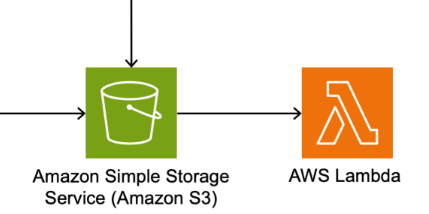
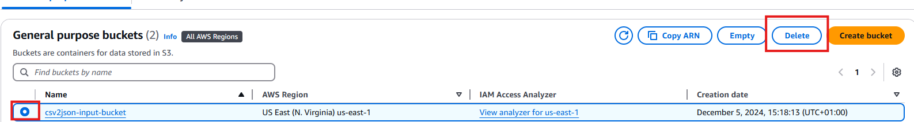
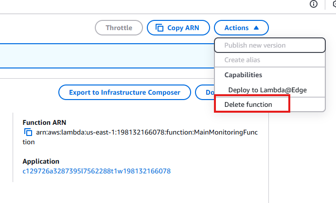
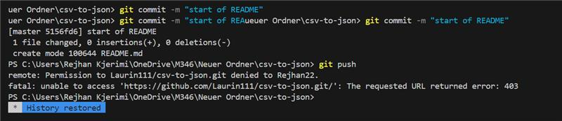

# Einleitung
Dieses Skript automatisiert die Einrichtung eines CSV-zu-JSON-Services auf über das AWS. Es erstellt die notwendigen Ressourcen wie S3-Buckets, Lambda-Funktionen und Event-Trigger, um eine reibungslose und möglichst effiziente Datenverarbeitung zu gewährleisten.

# Anleitung zur Anwendung des Bash-Skripts

## Übersicht
Dieses Skript dient zur Erstellung eines CSV-zu-JSON-Services mit AWS Lambda und IAM-Rollen. Es erstellt automatisch S3-Buckets, eine Lambda-Funktion und konfiguriert S3-Event-Trigger.

### Voraussetzungen
Stellen Sie sicher, dass folgende Software auf Ihrem Rechner installiert ist:

1. **AWS CLI**: Installieren Sie es von der offiziellen [AWS CLI Webseite](https://aws.amazon.com/cli/).
   
   ```bash
   aws --version
   ```
   
   Wenn der Befehl nicht erkannt wird, installieren Sie die AWS CLI und konfigurieren Sie sie mit `aws configure`.

2. **Dotnet CLI**: Installieren Sie die .NET SDK von [Microsofts .NET Webseite](https://dotnet.microsoft.com/).
   
   ```bash
   dotnet --version
   ```
   
   Falls der Befehl nicht funktioniert, laden Sie das .NET SDK herunter und installieren Sie es.

3. **AWS Account**: Stellen Sie sicher, dass Sie Zugang zu einem AWS-Konto haben und Berechtigungen besitzen, IAM-Rollen, S3-Buckets und Lambda-Funktionen zu erstellen. Falls dem nicht der Fall ist, funktioniert das Skript nicht.

4. **Github Repository**:
Als nächstes muss noch das Repository mit folgenden Befehlen auf ihren Rechner geklont werden.

```bash
git clone https://github.com/Laurin111/csv-to-json.git
```
5. **richtiger Ordner und Berechtigungen** 
Wechseln Sie mit folgendem Befehl in den richtigen Ordner 
``cd csv-to-json``

Die Berechtigungen müssen wie folgt gesetzt werden:
``chmod a+x init.sh ``

6. **Konfigurationsdatei bearbeiten**: Öffnen Sie das `init.sh`-Skript in einem Texteditor und passen Sie die folgenden Variablen an Ihre Bedürfnisse an:
   - `PROJECT_PATH`: Der Pfad zu Ihrem Projektverzeichnis, in dem die CsvToJsonConverter.csproj Datei liegt.

7. **CSV-Datei mit Testdaten**: Um das Skript vollständig auszuführen, braucht es eine `sample.csv` Datei, welche mit Testdaten gefüllt ist. Diese Datei muss entweder `sample.csv` heissen, oder sie passen in der Datei `init.sh` die Variable `CSV_FILE` nach dem Namen ihrer Datei an. Diese muss im gleichen Ordner wie die `init.sh` Datei liegen, damit das Skirpt ordnungsgemäss darauf zugreifen kann. Wichtig bei dieser Datei ist, dass das Trennzeichen ein `,` ist. Wenn dies geändert werden will, muss im Skript die Variable `CSV_DELIMITER` angepasst werden.

### Schritte zur Anwendung des Skripts

#### 1. Skript ausführen
Führen Sie das Skript mit folgendem Befehl aus:

```bash
bash init.sh
```

#### 2. Verifizieren der Ergebnisse
1. **S3-Buckets**:
   Überprüfen Sie, ob die S3-Buckets erfolgreich erstellt wurden:
   
   ```bash
   aws s3 ls
   ```

2. **Lambda-Funktion**:
   Verifizieren Sie die Lambda-Funktion:
   
   ```bash
   aws lambda list-functions
   ```

3. **Event-Trigger**:
   Überprüfen Sie die S3-Benachrichtigungskonfiguration:
   
   ```bash
   aws s3api get-bucket-notification-configuration --bucket <INPUT_BUCKET_NAME>
   ```

## CSV zu JSON Converter mit AWS Lambda

### Aufbau des Services

Der CSV zu JSON Converter ist ein cloudbasierter Dienst, der AWS Lambda verwendet, um CSV-Dateien in JSON-Dateien zu konvertieren. Der Service besteht aus mehreren Komponenten:

- **AWS Lambda**: Führt die Konvertierungslogik aus.
- **Amazon S3**: Speichert die Eingabe-CSV-Dateien und die Ausgabe-JSON-Dateien.
- **AWS CLI**: Wird verwendet, um die Infrastruktur zu konfigurieren und zu verwalten.

#### Diagramm der Architektur

Der Service Funktioniert so, dass eine CSV-Datei in den Input-Bucket geladen wird, und diese Automatisch in eine JSON datei umgewandelt wird. Dies Funktioniert mithilfe des Triggers. Dieser sorgt dafür, dass die Lambda Funktion, welche in unserem Fall mittels C# implementiert wurde, ausgeführt wird.



### Anforderungen

Um den Dienst zu nutzen, benötigen Sie:

- Ein AWS-Konto mit den erforderlichen Berechtigungen zum Erstellen von S3-Buckets und Lambda-Funktionen.
- Installierte Software:
  - **AWS CLI**: [Installationsanleitung](https://docs.aws.amazon.com/cli/latest/userguide/getting-started-install.html)
  - **Dotnet CLI**: [Installationsanleitung](https://learn.microsoft.com/en-us/dotnet/core/tools/dotnet)


### Nutzung

Die Nutzung unseres Services ist ganz leicht. Mann muss jediglich das `init.sh` Skript ausführen. Dieses kümmert sich um die erstellung der Buckets, der Lambda Funktion und der konfiguration des Triggers. Ebenfalls wird nach diesen Schritten die `sample.csv` in den Input-Bucket hochgeladen. Durch den Trigger wird die Lambda Funktion automatisch ausgeführt und die `output.json` Datei in den Output-Bucket geladen.

### Infrastruktur löschen

Gegebenenfalls können sie diese Infrastruktur wieder manuel in ihrem AWS Lab entfernen. 

1. **Bucket Löschen** Wählen sie den Gewünschten Bucket aus und drücken sie auf Delete. Machen sie dies für den Input und für den Output Bucket.


2. **Funktion Löschen** Gehen sie auf die erstellte Lambda Funktion und drücken sie auf `Actions` und dann `Delete function`. 


## Projekt-Team

- Laurin Ebnöther
- Rejhan Kjerimi
- Daniel Kaganov

## Funktionsweise und Erklärung

### Wie funktioniert der Service?

1. **Initialisierung**: 
   - Das `init.sh`-Skript ist ein Shell-Skript, das auf Ihrem Computer ausgeführt wird. Es überprüft zunächst, ob die erforderlichen Tools (AWS CLI und Dotnet CLI) installiert sind. Diese Tools sind notwendig, um mit AWS-Diensten zu kommunizieren und .NET-Anwendungen zu verwalten.
   - Das Skript erstellt zwei S3-Buckets: einen für die Eingabe-CSV-Dateien und einen für die Ausgabe-JSON-Dateien. S3-Buckets sind wie Ordner in der Cloud, in denen Dateien gespeichert werden können.

2. **Lambda-Funktion**: 
   - Die Funktion in `Function.cs` wird bereitgestellt. Diese Funktion wird durch S3-Events ausgelöst, wenn eine neue CSV-Datei in den Eingabebucket hochgeladen wird. 
   - Die Funktion liest die CSV-Datei, konvertiert sie mithilfe der `CsvConverter`-Klasse in JSON und speichert das Ergebnis im Ausgabebucket.

3. **Konvertierung**: 
   - Die `CsvConverter`-Klasse verwendet die Bibliothek `CsvHelper`, um die CSV-Daten zu lesen und in JSON zu konvertieren. Der Konverter berücksichtigt das angegebene Trennzeichen und erstellt eine JSON-Datei mit formatierten Daten.

4. **Automatisierung**: 
   - Der gesamte Prozess ist automatisiert. Sobald eine CSV-Datei hochgeladen wird, wird sie automatisch verarbeitet und die JSON-Datei wird im Ausgabebucket gespeichert.

### Benötigte Mittel für einen Funktionierenden Service

- **AWS Lambda**:
Ermöglicht die Ausführung von Code als Reaktion auf Ereignisse, ohne dass Server verwaltet werden müssen. Dies bedeutet, dass Sie sich keine Gedanken über die Infrastruktur machen müssen, die den Code ausführt.
- **Amazon S3**: Bietet skalierbaren Speicherplatz für die Eingabe- und Ausgabedateien. S3 ist ein sicherer und zuverlässiger Speicherort für Ihre Dateien.
- **Automatisierung**: Durch die Verwendung von S3-Event-Triggern wird die Lambda-Funktion automatisch ausgelöst, was den Prozess effizient und benutzerfreundlich macht. Dies bedeutet, dass Sie keine manuellen Schritte ausführen müssen, um die Konvertierung zu starten.

## Aufgabeneinteilung
Die Aufgabenverteilung unseres Projektes haben wir immer wieder abändern müssen. Dadurch, dass wir viele Prüfungen und Aufgaben in Schule hatten, konnten einige ihre Aufgaben nicht immer plangemäss druchführen. Das Ziel war es, die Aufgaben gerecht untereinander aufzuteilen. Was mit Abstand am meissten Zeit in Anspruch genommen hat, war die Programmierung der Funktion und des Skriptes.

|Aufgabe|Wer?|Zeitraum|
|-|-|-|
|Erste Schritte des C# evaluieren|Rejhan| 1.12 - 2.12|
|AWS Lambda Funktion in C# (CSV zu JSON) programmieren|Laurin| 2.12 - 5.12|
|Initialisierungs-Skript `init.sh` zur Erstellung der AWS Infrastruktur|Laurin| 5.12 - 19.12|
|Testen des Skripts |Daniel| 5.12 - 6.12|
|Fehlerbehebung des Skrip |Laurin| 5.12 - 19.12|
|Fehlerbehebung der C# Lambda Funktion |Laurin| 2.12 - 19.12|
|Erweitern der `init.sh` mit automatisches Hochladen einer `sample.csv` |Laurin|10.12 - 19.12|
|Readme / Dokumentation mit allen geforderten Inhalten schreiben|Rejhan|15.12 - 20.12|
|Readme / Dokumentation sauber formatieren|Rejhan|19.12 - 20.12|
|Test Dokumentation|Daniel|20.12 - 20.12|
|Readme nachprüfen|Daniel|20.12 - 20.12|
|Testdoku nachprüfen|Rejhan|20.12 - 20.12|


## Quellenverzeichnis

- [AWS CLI Dokumentation](https://docs.aws.amazon.com/cli/latest/userguide/cli-chap-welcome.html)
- [Dotnet CLI Dokumentation](https://learn.microsoft.com/en-us/dotnet/core/tools/)
- [AWS Lambda Dokumentation](https://docs.aws.amazon.com/lambda/latest/dg/welcome.html)
- [CsvHelper Dokumentation](https://joshclose.github.io/CsvHelper/)

## Reflexion

Unser Ablauf des Projektes hat im Grundsatz gut funktioniert. Unser Problem war jedoch, dass wir unser Skript nicht so zum Laufen gebracht haben, wie wir es uns erhofft hatten. Wir mussten viele Anpassungen vornehmen, die uns schlussendlich viel Zeit gekostet haben, welche wir jedoch nicht hatten. Dies ist genau die Schwierigkeit einer solchen Projektarbeit. Durch Komplikationen wird der Zeitplan durcheinandergebracht, und man muss schnell und effektiv Lösungen für die Probleme finden. Ebenfalls hatten wir parallel noch zwei andere Projektarbeiten und Prüfungen.

Der aktuelle Stand unseres Projektes ist so, dass wir mit allem fertig sind, es jedoch nicht so funktioniert, wie wir es uns erhofft hatten. Wir haben zurzeit einen Fehler in unserem Service, der uns die CSV-Datei nicht konvertieren lässt. Wir können diesen Fehler jedoch nicht so leicht reproduzieren, da wir keine Fehlermeldungen in den CloudWatches der AWS-Cloud haben. Dadurch, dass wir zeitlich keine Kapazitäten mehr haben, müssen wir leider auf diesem Stand verweilen.

Bei der ersten Version des Skriptes hat gar nichts funktioniert. Wir hatten Probleme mit .NET 8, da wir dies anfangs nicht installieren konnten. Ebenfalls haben unsere VMs nicht ordnungsgemäss funktioniert, sodass wir diese neu installieren und konfigurieren mussten. Zudem hat unsere Implementierung, wie die Lambda-Funktion erstellt wird, die Berechtigungen gesetzt werden und auf die AWS-Cloud geladen wird, nicht funktioniert. Wir sassen stundenlang zusammen und wussten nicht, was und warum dies nicht funktionierte. Herr Dall Acqua hat uns schlussendlich dabei geholfen, was uns sehr viel gebracht hat.

Dass unser Skript anfangs nicht funktioniert hat, hatte aber für uns persönlich nicht nur Nachteile. Wir konnten viel aus unseren Fehlern mitnehmen und unser Wissen im Bereich AWS und Linux Bash erheblich erweitern. Fehler sind nicht immer etwas Schlechtes, da man so am besten lernt. Jedoch ist es trotzdem schade, dass wir keinen funktionsfähigen Service hinbekommen haben.

Mögliche Verbesserungsvorschläge wären, dass wir die Zeit besser abschätzen und uns einen gewissen Puffer für mögliche Komplikationen einplanen. Wichtig für uns ist jetzt, dass wir aus unseren Schwierigkeiten und Fehlern lernen und diese für die Zukunft in Erinnerung bleiben.

### Laurin
Ich persönlich habe die Projektarbeit und die Aufgaben als angemessen empfunden. Wir hatten das Vorwissen, welches wir für die Umsetzung brauchten, und es wurden keine Aufgaben erstellt, die wir nicht lösen konnten. Ebenfalls konnten wir frei entscheiden, wie wir die Projektarbeit implementieren, was mir definitiv zugutekam. Wir haben uns nach längerer Evaluation für C# entschieden, da wir uns dort bereits auskennen. Die Aufgabenverteilung hat nach meinem Ermessen leider nicht immer gut geklappt, da wir noch viel anderes in der Schule zu tun hatten. Dadurch, dass das Skript anfangs nicht funktioniert hat, mussten wir viele Aufgaben vertagen und neu aufteilen.

Trotz aller Schwierigkeiten habe ich mir viel Mühe gegeben, alle Aufgaben sauber und nach den Kriterien zu erledigen. Ich persönlich konnte sehr viel aus dieser Arbeit mitnehmen und mein Wissen zu Cloud-Umgebungen, C# und Linux Bash erweitern.
### Rejhan

Ich meinerseits, kann die Projektarbeit für das Modul 346 mit einem sehr positiven Gefühl abschliessen. Aufgrund von anderweitigen Aufträgen in der Schule war es keine einfache Aufgabe, sich an die Planung zu halten und wir mussten vieles noch umplanen und flexibel arbeiten.
 
Da im Team eine starke Harmonie herrschte und wir uns bei den meisten Entscheidungen schnell einig waren, konnten wir trotz dieser Herausforderungen schlussendlich ein zufriedenstellendes Endprodukt erarbeiten.
 
Leider haben wir es nicht geschafft, dass alles so läuft wie wir es geplant hatten. Wir haben jedoch das beste aus der Situation herausgeholt und das haben wir unserem starken Teamgeist zu verdanken. Wir haben uns an einander angepasst, unsere Fähigkeiten kombiniert und unsere Schwächen ausgeglichen und minimiert.
 
Ich meiner seits hatte ebenfalls ein Lokales Problem, welches dazu führte, dass ich meine änderungen nicht auf unser gemeinsames Repository pushen konnte. Der Herr Ebnöther ist mir hier glücklicherweise zur hand gegangen, ich konnte ihm meine Dateien schicken und er hat diese dann für mich auf das Repository gepusht. Dies hat jedoch den Nachteil, dass man in der Versionskontrolle meine Änderungen nicht nachverfolgen kann.
 

 
Ich werde, trotz allen schwierigkeiten, einige neue Kompetenzen und Fähigkeiten aus dieser Projektarbeit mitnehmen. Das Wertvollste, das ich in dieser Zeit gelernt habe ist, dass ein gutes Team nicht unbedingt ein perfektes Endprodukt hervorbringen muss. Ein gutes Team wird trotz Problemen und Schwierigkeiten zusammenhalten und das best mögliche aus der aktuellen Situation herausholen.

### Daniel
Im Rahmen eines dreiwöchigen Projekts in einer Dreiergruppe haben wir ein Skript entwickelt, das mit Hilfe von AWS Buckets und Lambda-Funktionen eine CSV-Datei in ein JSON-Format konvertiert. Meine Rolle im Projekt umfasste die Durchführung von Tests, Unterstützung bei der Dokumentation sowie die Mitwirkung an der Entwicklung des Skriptes.

Eine der anfänglichen Herausforderungen bestand darin, die korrekten Berechtigungen für die IAM-Rolle (LabRole) zu verstehen und einzurichten. Durch gezielte Recherche und gemeinsames Erarbeiten von Lösungen konnten wir dieses Problem erfolgreich überwinden.

Mein Fokus lag auf dem Testing des Skriptes. Dabei habe ich Tests erstellt, die von vornherein davon ausgingen, dass Fehler auftreten würden. Im Ergebnis haben die Tests zwar vor allem gezeigt, dass bestimmte Aspekte nicht wie erwartet funktionierten, jedoch trugen sie wenig zur unmittelbaren Verbesserung bei. Dennoch waren sie ein wichtiger Schritt, um potenzielle Probleme sichtbar zu machen.

Die Zusammenarbeit in der Gruppe empfand ich als äusserst positiv. Besonders hervorzuheben ist, dass Laurin die Führungsrolle übernommen und die Aufgabenverteilung koordiniert hat. Diese klare Rollenverteilung hat erheblich dazu beigetragen, das Projekt effizient umzusetzen.

Abschliessend kann ich sagen, dass die Zusammenarbeit und der Austausch im Team entscheidend für den Erfolg des Projektes waren.