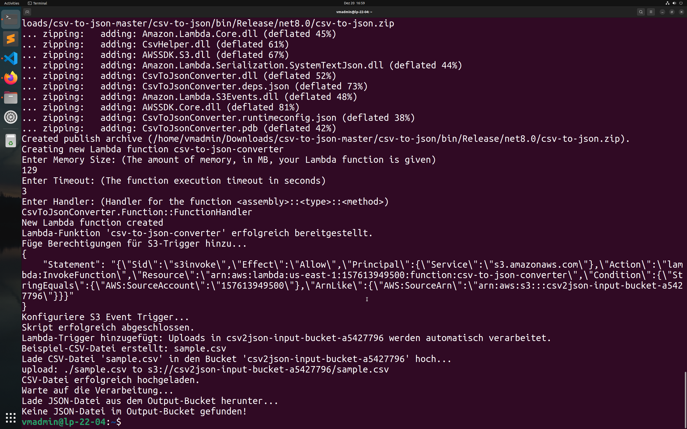
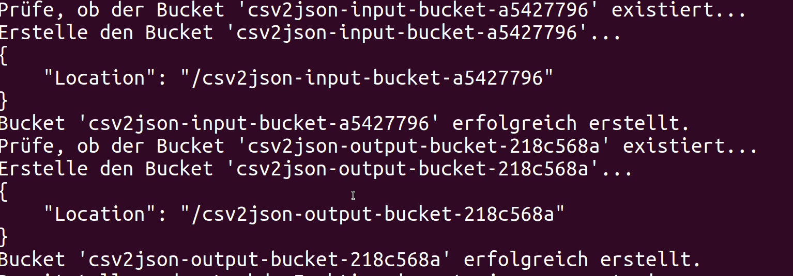
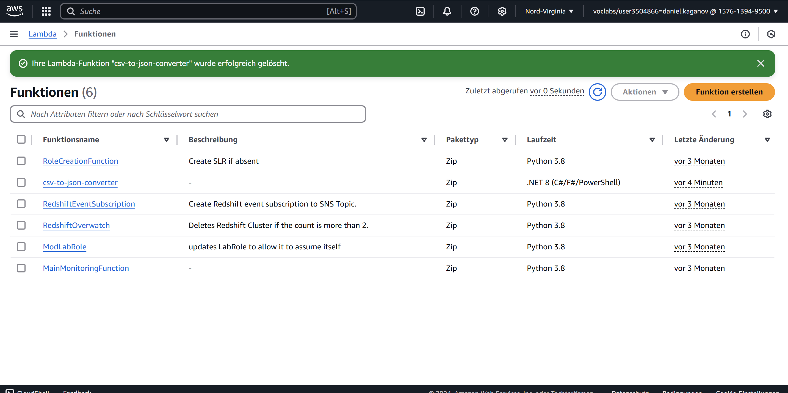
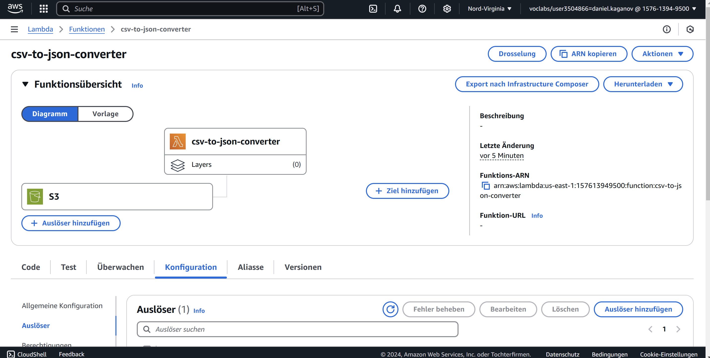
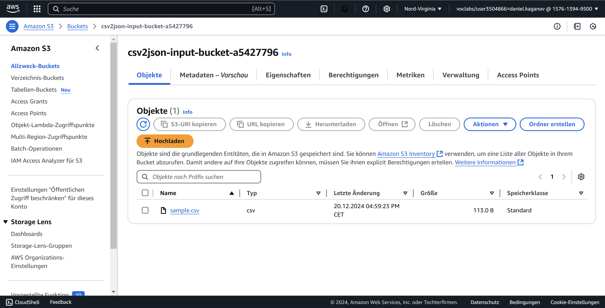
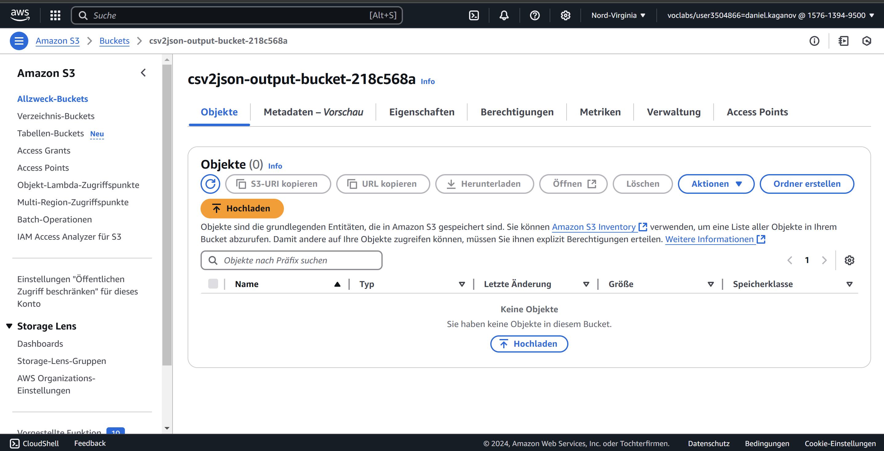
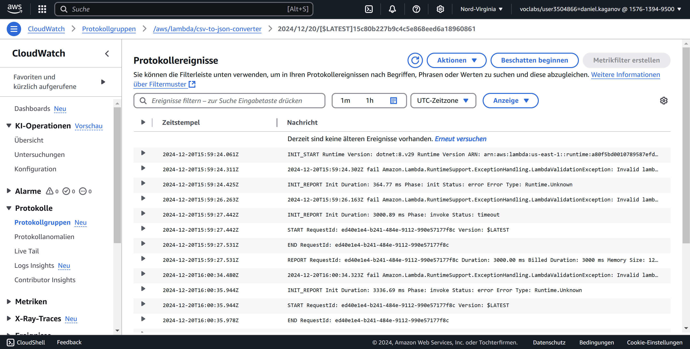

# Einführung zu den Tests
In unserem Projekt, welches die automatische Umwandlung von CSV-Dateien in JSON über AWS Lambda und S3-Buckets ermöglichen sollte, haben wir grundlegende Tests durchgeführt, um sicherzustellen, dass die Funktionalität korrekt umgesetzt wurde. Ziel war es, eine Eingabedatei in einen S3-Bucket hochzuladen, die anschliessend von einer Lambda-Funktion verarbeitet wird, um die Ausgabe als JSON in einem separaten S3-Bucket zu speichern. Die Tests sollten uns helfen, eventuelle Fehler in der Pipeline zu identifizieren und den Prozess zu validieren. Dies war besonders wichtig, da der Workflow von mehreren abhängigen Komponenten und Konfigurationen abhing, deren Zusammenspiel sich als entscheidend herausstellte.

## Übersicht der Tests
| Name      | Tester         | Testzeitpunkt      | Art des Tests             |
|-----------|----------------|--------------------|---------------------------|
| Test 1    | Daniel Kaganov | 20.12.2024, 15:00 | Funktionalitätstests      |

### Beschreibung des Problems
Das Skript lief bis zu einer Fehlermeldung weitgehend problemlos. Es wurden sowohl die Input- und Output-Buckets als auch die Lambda-Funktion erfolgreich erstellt.  

In der AWS-Konsole konnte man die erstellte Funktion sowie die angekoppelten S3-Buckets sehen.   Zudem war der Input-Bucket korrekt mit einer hochgeladenen CSV-Datei gefüllt , während der Output-Bucket leer blieb und keine JSON-Datei enthielt. Diese Beobachtungen deuteten darauf hin, dass die Verarbeitung innerhalb der Lambda-Funktion nicht korrekt abgeschlossen wurde, obwohl die Infrastruktur scheinbar korrekt eingerichtet war.

Eine der grössten Herausforderungen bestand darin, dass der Workflow zwar ausgeführt wurde, aber keine konkreten Fehlermeldungen in den CloudWatch-Protokollen angezeigt wurden. Dies machte die Fehlersuche extrem schwierig, da unklar blieb, ob das Problem in der Konfiguration, in der Lambda-Funktion selbst oder in den Berechtigungen zwischen den Komponenten lag. Ohne spezifische Hinweise war es fast unmöglich, den eigentlichen Fehler zu identifizieren.

Ein weiterer Punkt, der die Analyse erschwerte, war die Komplexität der AWS-Plattform. Die Vielzahl an Konfigurationsmöglichkeiten und Abhängigkeiten zwischen Ressourcen wie S3-Buckets, IAM-Rollen und der Lambda-Funktion erforderte eine sehr genaue Abstimmung. Bereits kleine Ungenauigkeiten in den Berechtigungen oder Einstellungen können dazu führen, dass der gesamte Workflow nicht wie geplant funktioniert.

### Fazit
AWS ist eine leistungsstarke, aber auch hochkomplexe Plattform, die für Einsteiger und selbst für erfahrene Entwickler Herausforderungen mit sich bringt. Das Fehlen spezifischer Fehlermeldungen in unserem Fall hat deutlich gezeigt, wie wichtig es ist, detaillierte Logs und Debugging-Optionen zu nutzen. Da uns kein klarer Fehler angezeigt wurde, war es uns leider nicht möglich, das Problem zu beheben. Ein detaillierteres Debugging, inklusive der Analyse der genauen Ausführung innerhalb der Lambda-Funktion sowie eine Prüfung der IAM-Berechtigungen, wären die nächsten Schritte, um den Kern des Fehlers zu identifizieren.

Unsere Erfahrungen zeigen, dass es in Projekten wie diesen entscheidend ist, von Anfang an auf eine robuste Fehlersuche zu setzen und möglicherweise sogar auf alternative Tools oder Methoden zur Fehlerdiagnose zurückzugreifen. Die Plattform selbst ist mächtig, erfordert jedoch eine erhebliche Einarbeitungszeit und ein tiefes Verständnis der zugrunde liegenden Systeme, um effizient genutzt werden zu können.

